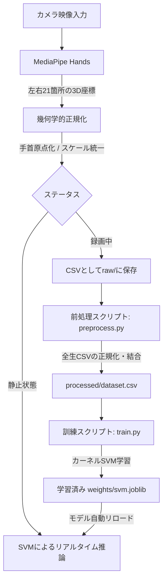

# 📝 少数データ手話動作学習プロジェクト (Hand Sign VLA Framework)

本プロジェクトは、小規模なデータセット（Few-shot / Sample-efficient）を用いて、人間の手の動き（手話・指文字）を効率的に抽出し、分類や動作生成へと結びつける高効率な手話アクション獲得のための研究用フレームワークです。

---

## 1. プロジェクト構造とファイルの役割

本リポジトリは以下のような設計になっています。

```text
research-hand-sign/
├── README.md                   # 本ドキュメント (プロジェクト概要・数理技術・実行手順)
├── requirements.txt            # Pythonライブラリ依存関係 (Pillow, OpenCV, MediaPipe, Scikit-Learn 等)
├── pyrightconfig.json          # エディタの型エラー・インポート警告を抑制する設定
│
├── docs/                       # 研究用の仕様・ドキュメント
│   ├── requirements_definition.md  # 研究テーマの要件定義書
│   └── system_architecture.md       # システムの全体設計書
│
├── data/                       # 手話座標データセットの保存先
│   ├── raw/                    # 各文字に対応するレコーディング生CSV (文字名_連番.csv)
│   └── processed/              # 一括前処理・正規化済みの統合データセット (dataset.csv)
│
└── src/                        # ソースコード
    ├── perception/             # 視覚・骨格トラッキング (Vision)
    │   └── hand_tracking.py        # MediaPipeを用いた手の検出・骨格座標の抽出処理
    ├── learning/               # 機械学習モデルと前処理 (Model)
    │   ├── model.py                # 学習モデルアーキテクチャ (SVM / MLP) の定義
    │   ├── preprocess.py           # 3次元座標データの幾何学的正規化 (手首基準化・スケール統一)
    │   ├── train.py                # データセットの自動分割 (Train/Test) とモデルの訓練処理
    │   ├── quantizer.py            # [NEW] K-Meansを用いた関節座標の量子化・離散トークン化
    │   ├── vla_dataset.py          # [NEW] VLAモデル学習用データセット(JSONL)生成コンバーター
    │   ├── vla_train_colab.py      # [NEW] Google Colabで実行するVLA LoRAトレーニング用のPyTorchコード
    │   └── VLA_LoRA_Notebook.ipynb # [NEW] Google Colab用の本物のノートブック
    └── ui/                     # Web インタラクティブUI
        ├── dashboard.py            # FastAPIバックエンド (カメラ制御・録画・APIサーバー)
        └── templates/
            └── index.html          # HTML5 Canvas / CSS 変数対応のダーク・ライトモードダッシュボード
```

---

## 2. 採用されている主要な技術と数理モデル

### ① MediaPipe Hands による 3D 骨格座標の抽出
生のビデオ画像（RGB画像）から手のランドマークを抽出します。
* **出力**: 左右それぞれ21箇所ずつの関節点における3次元座標 `(x, y, z)`、合計126次元の特徴量ベクトル。
* **メリット**: 生動画のピクセルデータを直接扱う場合に比べてデータ量が数万分の一に削減されるため、膨大な Vision エンコーダの学習負荷をバイパスし、超低コストでの学習が可能になります。

### ② 幾何学的データ正規化（preprocess.py）
手の映る位置や大きさのブレによる誤作動を防ぐため、MediaPipe から得られた 126次元の生データに以下の幾何変換を施します。
1. **手首原点化 (Translation Normalization)**:
   手首の座標（ID: 0）を `(0, 0, 0)` とし、全ての関節点を手首からの相対座標に変換します。これにより、カメラの画角内で手がどこに映っていても同じ特徴として扱えます。
2. **スケール正規化 (Scale Normalization)**:
   手首（ID: 0）から中指の付け根（ID: 9）までの幾何学的距離を求め、全ての関節座標をこの距離で割ることでスケールを `1.0` に統一します。これにより、カメラからの距離や手の個人差（手の大きさ）の差異を吸収します。

### ③ RBFカーネルSVM（サポートベクターマシン）による少数データ分類
得られた正規化座標（126次元）をインプットとして、手の形（ひらがなクラス）を分類します。
* **アルゴリズム**: 非線形な境界線を引くことに優れた **RBF (Radial Basis Function) カーネルSVM** を採用しています。
* **特徴**: サポートベクターと呼ばれる境界近くのデータのみを使って学習するため、ディープラーニングと異なり、**1文字あたりわずか3〜5回の録画（Few-shot）だけでほぼ100%に近い精度で境界線を引くことが可能**です。

---

## 3. 具体的な処理の流れ



### ① データ収録 (Data Collection)
Web UIの「録画」ボタンを押すことで、MediaPipeが検出した `126次元` の骨格座標を約30fps周期でCSVに追記保存します。
### ② 一括前処理 (Preprocessing)
`data/raw/` 以下のすべてのCSVをロードし、上記の正規化を全フレームに対して実行し、正解ラベル列（例: "a"）を最後尾に付与して `data/processed/dataset.csv` に統合します。
### ③ モデル学習 (Model Training)
データを訓練データ（80%）とテストデータ（20%）にシャッフル・分割し、SVMモデルを訓練します。訓練完了後、テストデータで正解率（Accuracy）などを算出して評価レポートを出力し、最新の重みを `hand_sign_model_svm.joblib` に保存します。
### ④ リアルタイム推論 (Real-time Inference)
カメラから手首の移動速度が閾値以下になる（手がピタッと止まる）と、自動的に最新の学習済みSVMモデルで推論を行い、最も高い確率のクラスが画面にオーバーレイ表示され、1秒以上キープされるとタイピング文字として順次スタックされていきます。

---

## 4. VLAモデル連携のためのデータセット生成（アプローチA・B）

本フレームワークは、オープンソースのVLA（Vision-Language-Action）基盤モデル（例: OpenVLAなど）に対して、極小の追加データで効率的に手話動作をLoRA学習（追加学習）させるためのデータ作成環境を備えています。

### ① アプローチB用：ポーズの量子化（離散トークン化）の事前学習
手の連続的な動き（座標軌跡）をそのままVLAに流すのではなく、データサイエンスの手法（K-Meansクラスタリング）を用いて、特徴的な手の形を離散的な「行動トークン」に変換します。

以下のコマンドを実行すると、現在 `data/raw/` 以下に収録されている全データから、手の関節パターンの代表的なポーズの重心点（コードブック）を自動学習し、モデルとして保存します。
```bash
python3 src/learning/quantizer.py
```
* **出力**: `src/learning/weights/pose_quantizer.joblib` (K-Meansモデル)
* **評価**: 量子化後の「再構成誤差（Mean Squared Error）」が出力されます。この値が十分に小さい（例：`0.0001` 程度）であれば、手のポーズをほぼ形状崩れなくトークンIDへと圧縮・復元できていることを示します。

### ② VLA学習用 JSONL データの書き出し（アプローチA・B共通）
収録されたすべての手話モーションデータを、VLAモデルのファインチューニングで利用可能なJSONL（Hugging Face互換形式）にワンクリックで変換・出力します。

以下のコマンドを実行します。
```bash
python3 src/learning/vla_dataset.py
```
* **出力**:
  1. `data/processed/vla_continuous.jsonl` (アプローチA用: 連続座標データセット)
     * 形式: `{"instruction": "ひらがなの『あ』を手話で表現してください。", "image": "...", "actions": [[x1,y1,z1...], [x2,y2,z2...]]}`
  2. `data/processed/vla_discrete.jsonl` (アプローチB用: 離散トークンデータセット)
     * 形式: `{"instruction": "ひらがなの『あ』を手話で表現してください。", "output": "<pose_2> <pose_45> <pose_12>..."}`