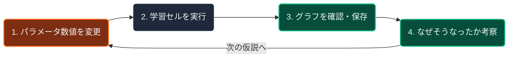

# 📊 手話VLAシステム：簡略フローマップ＆テーマ整合性

あなたのグループが5月から進めてきた**「手話データ収集」から「VLAモデル学習」への歩み**と、現在のシステムが当初の目標にどう合致しているかを1本のシンプルなフローチャートにまとめました。

---

## 🗺️ 1. シンプルな全体フローマップ

```mermaid
flowchart TD
    %% スタイル設定
    classDef stageLocal fill:#1e293b,stroke:#06b6d4,stroke-width:2px,color:#f3f4f6;
    classDef stageColab fill:#2e1065,stroke:#a855f7,stroke-width:2px,color:#f3f4f6;
    classDef fileNode fill:#0f172a,stroke:#334155,color:#9ca3af;
    classDef highlight fill:#f59e0b,stroke:#d97706,stroke-width:2px,color:#0f172a,font-weight:bold;

    %% --- ① ローカルPCでの作業 ---
    subgraph Local["【① ローカルPC環境】データを作る・確認する"]
        A["📸 Webカメラ"] -->|MediaPipeで追跡| B("手の3D座標を取得")
        B -->|CSVファイルに記録| C["📄 生座標CSVデータ"]
        C -->|手首原点・中指スケール統一| D("幾何正規化処理")
        D -->|ズレを除去したデータ| E["📄 正規化CSVデータ"]
        E -->|時系列をポーズトークン化| F["VLA翻訳エクスポート (vla_dataset.py)"]
        F --> G["💾 VLA学習用 JSONLデータ"]
    end

    class A,B,D,F stageLocal;
    class C,E,G fileNode;

    %% --- クラウドへの橋渡し ---
    G -->|git push| GitHub["☁️ GitHub"]
    class GitHub fileNode;

    %% --- ② Google Colabでの作業 ---
    GitHub -->|git clone| Border{"🚀 ここからGoogle Colab上の作業"}
    class Border highlight;

    subgraph Colab["【② Google Colab環境】VLAモデルを鍛える"]
        Border --> H["💾 分割データ (学習用 80% / 検証用 20%)"]
        I["🤗 Hugging Face"] -->|モデルDL| J["🧠 OpenVLA-7B 基盤モデル"]
        
        H & J --> K["LoRA学習の実行 (VLA_LoRA_Notebook.ipynb)"]
        K -->|評価ロスの比較| L["📈 研究評価グラフ (Train vs Val Loss)"]
        K -->|学習済みの追加の脳| M["💾 Google Driveへ保存 (LoRA重み)"]
    end

    class H,L,M fileNode;
    class J,K stageColab;
    class I stageColab;
    
    style Local fill:#090d16,stroke:#06b6d4,stroke-width:1px;
    style Colab fill:#13091f,stroke:#a855f7,stroke-width:1px;
end
```

---

## 🔬 2. 数値を書き換えて「研究（実験）」を行うループ

卒論としての「研究」は、**「条件（パラメータの数値やテキスト）を変えて学習させ、結果のグラフがどう変化するかを分析する」** という以下のサイクルを回すことで行います。



### 📝 具体的に「どこの数値」を書き換えて実験するのか？

本研究では、以下の**3つの数値・設定**を書き換えて比較実験を行い、その差を論文にまとめます。

#### 【実験A】動作の量子化解像度の変更（クラスタ数 $K$ の検証）
* **書き換えるファイル/場所**: ローカルPCの `src/learning/vla_dataset.py` 内の `n_clusters` の数値。
* **変える数値**: **`32`**、**`64`**、**`128`** など。
* **研究の目的**: 手の形を何段階の「代表ポーズ（単語）」に分けるのが、最も効率よく綺麗に手話を表現できるかの黄金比（トレードオフ）を探します。

#### 【実験B】LLMの適合パラメータ容量の変更（LoRA ランク $r$ の検証）
* **書き換えるファイル/場所**: Colab上のノートブック `VLA_LoRA_Notebook.ipynb` 内の `Experiment_Type = "compare_lora_rank"` 選択時、または `get_lora_config(rank)` 内の `r` の数値。
* **変える数値**: **`8`**、**`16`**、**`32`** など.
* **研究の目的**: VLAの言語脳をどれくらい「深く」書き換えるのが、少量データでの手話習得に最適かを調べます。

#### 【実験C】指示プロンプトの意味論の変更（言語理解の効果検証）
* **書き換えるファイル/場所**: Colab上のノートブックの `Experiment_Type` プルダウンで選択。
* **変える設定**: 
  * **`Simple ID` (True)**: 意味を持たない記号（例：`ClassID_01`）
  * **`Natural Japanese` (False)**: 意味のある日本語（例：`「ひらがなの『あ』を手話で表現してください」`）
* **研究の目的**: LLMが元々知っている「日本語の意味」が、手の動かし方を覚えるスピードをどれくらい助けているかを証明します。
