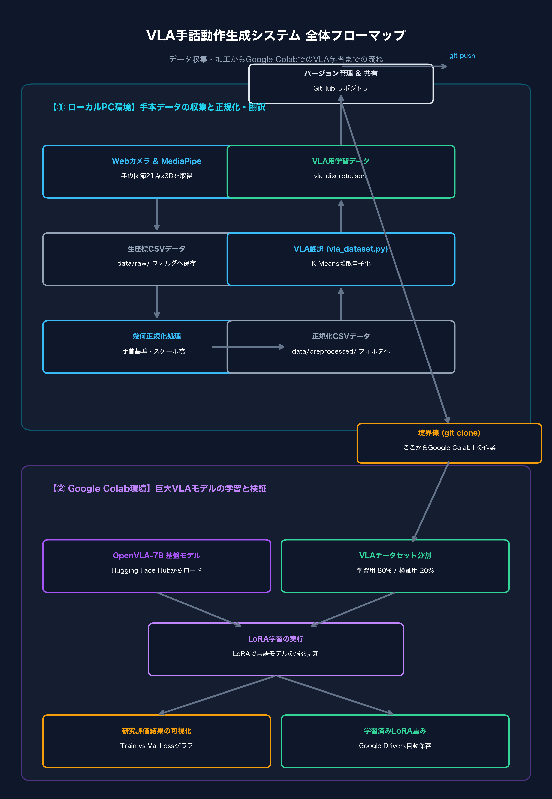

# 📊 手話VLAシステム：全体フローマップ＆テーマ整合性

あなたのグループが5月から進めてきた**「手話データ収集」から「VLAモデル学習」への歩み**と、現在のシステムが当初の目標にどう合致しているかを1本のフローチャートにまとめました。

---

## 🗺️ 1. 全体データフローマップ



---

## 🔬 2. 数値を書き換えて「研究（実験）」を行うループ

卒論としての「研究」は、**「条件（パラメータの数値やテキスト）を変えて学習させ、結果のグラフがどう変化するかを分析する」** という以下のサイクルを回すことで行います。

```
[1. パラメータの数値・設定を変更]
               │
               ▼
   [2. Colabで学習を実行]
               │
               ▼
   [3. グラフ(Train/Val Loss)の比較・保存]
               │
               ▼
   [4. アプローチの差について考察・分析]
               │
               ▼
(次のパラメータへ変更し、ループを回す)
```

### 📝 具体的に「どこの数値」を書き換えて実験するのか？

本研究では、以下の**3つの数値・設定**を書き換えて比較実験を行い、その差を論文にまとめます。

#### 【実験A】動作の量子化解像度の変更（クラスタ数 K の検証）
* **書き換えるファイル/場所**: ローカルPCの `src/learning/vla_dataset.py` 内の `n_clusters` の数値。
* **変える数値**: **`32`**、**`64`**、**`128`** など。
* **研究の目的**: 手の形を何段階の「代表ポーズ（単語）」に分けるのが、最も効率よく綺麗に手話を表現できるかの黄金比（トレードオフ）を探します。

#### 【実験B】LLMの適合パラメータ容量の変更（LoRA ランク r の検証）
* **書き換えるファイル/場所**: Colab上のノートブック `VLA_LoRA_Notebook.ipynb` 内の `Experiment_Type = "compare_lora_rank"` 選択時、または `get_lora_config(rank)` 内の `r` の数値。
* **変える数値**: **`8`**、**`16`**、**`32`** など。
* **研究の目的**: VLAの言語脳をどれくらい「深く」書き換えるのが、少量データでの手話習得に最適かを調べます。

#### 【実験C】指示プロンプトの意味論の変更（言語理解の効果検証）
* **書き換えるファイル/場所**: Colab上のノートブックの `Experiment_Type` プルダウンで選択。
* **変える設定**: 
  * **`Simple ID` (True)**: 意味を持たない記号（例：`ClassID_01`）
  * **`Natural Japanese` (False)**: 意味のある日本語（例：`「ひらがなの『あ』を手話で表現してください」`）
* **研究の目的**: LLMが元々知っている「日本語の意味」が、手の動かし方を覚えるスピードをどれくらい助けているかを証明します。
