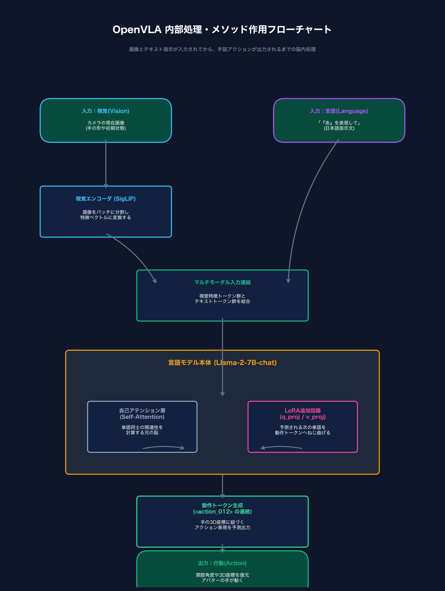

# 🧠 OpenVLAの内部処理メカニズムと作用フロー

手話VLAシステムにおいて、**OpenVLAモデルが画像とテキストを入力されてから、どのように手の動き（アクション）を決定・出力しているのか**の仕組みを、フローチャートとテキストで整理しました。

---

## 🗺️ 1. OpenVLA 内部動作フローチャート

---

## 📖 2. 内部メカニズムのステップ解説

このシステムの中枢であるOpenVLAは、以下の **5つのステップ** で画像と言葉を手の動きへ変換（翻訳）しています。

### 【STEP 1】入力データの受け取り（Vision & Language）
モデルには同時に2つの情報が入力されます。
* **視覚入力 (V)**: カメラが捉えた「現在の手の画像（またはアバターの初期位置）」。
* **言語入力 (L)**: ユーザーからの指示文（例：`「ひらがなの『あ』を手話で表現してください」`）。

### 【STEP 2】視覚エンコーダによる画像の特徴量抽出
入力された画像は、視覚エンコーダである **SigLIP**（約27億パラメータ）によって処理されます。
* 画像を細かく分割（パッチ化）し、どこに手があり、どのような形をしているかの「空間的な特徴ベクトル」に変換して、画像トークン群（視覚情報のかたまり）を作ります。

### 【STEP 3】マルチモーダル入力の連結
画像から抽出された「視覚トークン」と、指示文を形態素解析した「テキストトークン」を1列に繋ぎ合わせます。
* 構成：`[画像トークン群] + [指示文トークン群]` ➔ 1つの長い入力配列としてLLMへ渡します。

### 【STEP 4】言語モデル（LLM）とLoRA追加回路の処理
合体した入力が、脳の本体である **Llama-2-7B**（言語モデル）に入ります。
* **元の脳（アテンション層）**:
  言葉の意味（「あ」を表現する）と、画像（手の初期姿勢）の関連性を計算します。
* **LoRA追加回路（q_proj / v_proj）の効果**:
  ここが最大のポイントです。通常、LLMは関連性から「テキストの言葉」を予測しようとしますが、アテンション層の横に割り込ませたLoRAのバイパス回路が、**「テキストの代わりに、手の3D座標トークンを出力せよ」**とアテンションの計算結果を強制的にねじ曲げます。

### 【STEP 5】動作トークンの生成と物理アクションへのデコード
ねじ曲げられた結果、LLMは予測結果として **アクション用の離散トークン**（例：`<action_24> <action_12>` など）を出力します。
* このトークンをデコード（逆変換）し、各関節の $X, Y, Z$ 座標や角度の連続データに復元します。
* 最終的に、ロボットハンドやCGアバターにこのデータが送信され、手話の動きとして画面上で表現されます。

---

## 💡 論文に書く際のキーポイント
> VLA（Vision-Language-Action）モデルは、**「言語（L）のコンテキスト理解力」をそのまま利用して「物理アクション（A）」の出力を推論する**ために、言語モデル（LLM）のアテンション層を直接LoRAで書き換えている点が最大の特徴です。これによって、言語と動作が直接マッピングされます。
